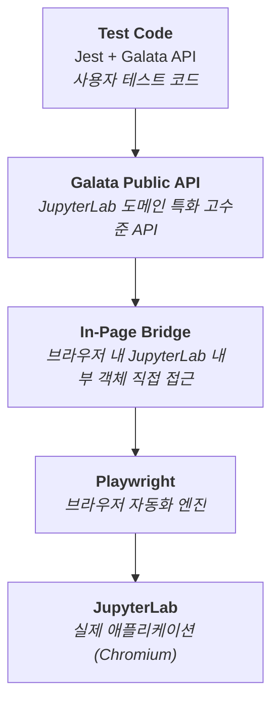
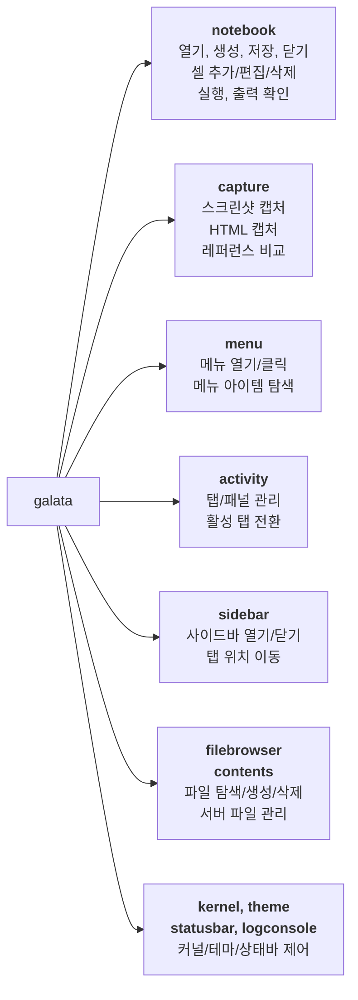
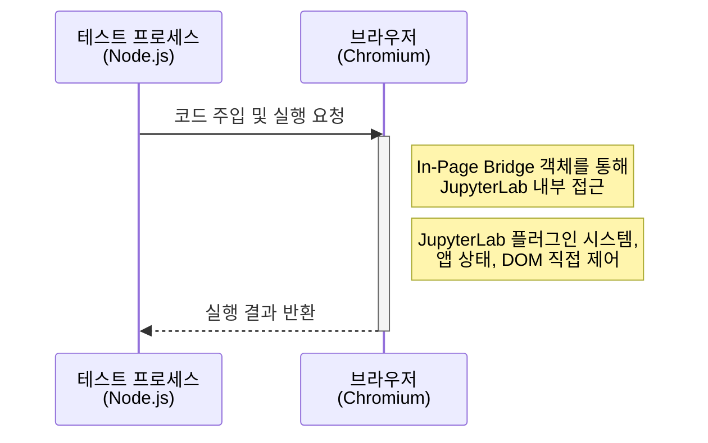
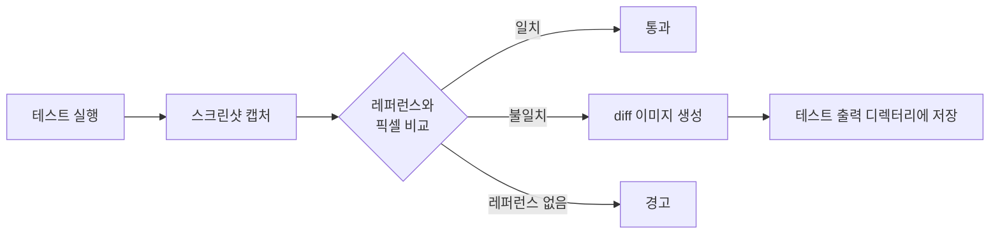
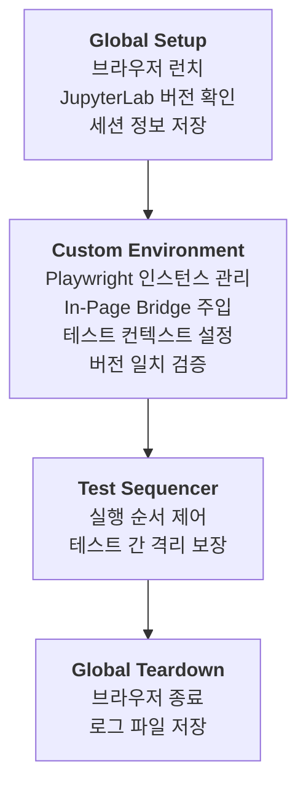
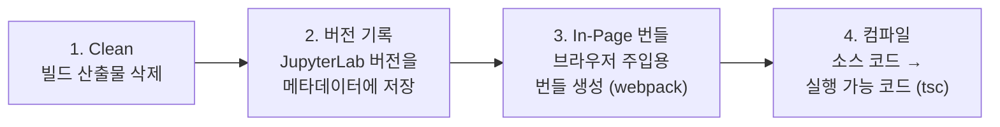

# Galata 기술 분석 문서

## 1. 프로젝트 개요

| 항목 | 내용 |
|------|------|
| 이름 | @jupyterlab/galata |
| 버전 | 3.0.11-4 |
| 라이선스 | BSD-3-Clause |
| 원 저작권 | Bloomberg Finance LP |
| 현 관리 | Project Jupyter |
| 상태 | Archived (jupyterlab/jupyterlab 메인 레포로 통합) |

Galata는 JupyterLab 전용 E2E/UI 테스트 프레임워크로, Playwright 기반의 브라우저 자동화 위에 JupyterLab 도메인 특화 API를 제공한다.

---

## 2. 아키텍처

### 2.1 레이어 구조



Galata는 5개 레이어로 구성된다. 사용자 테스트 코드는 Galata Public API만 호출하면 되고, 그 아래의 In-Page Bridge, Playwright, JupyterLab 인스턴스는 프레임워크가 자동으로 관리한다.

### 2.2 핵심 설계 결정

| 설계 결정 | 설명 |
|-----------|------|
| **Namespace 기반 API** | notebook, menu, sidebar 등 JupyterLab UI 영역별로 API를 그룹핑하여 직관적 접근 제공 |
| **In-Page Injection** | 브라우저 내부에 코드를 주입하여 JupyterLab의 플러그인 시스템에 직접 접근 (외부 관찰만으로는 불가능한 내부 상태 제어) |
| **Jest Custom Environment** | Playwright 브라우저 라이프사이클을 Jest 테스트 러너에 통합하여 단일 프레임워크로 동작 |
| **Workspace 격리** | 테스트마다 독립 워크스페이스를 자동 생성하여 테스트 간 상태 오염 방지 |

---

## 3. 프로젝트 구조

Lerna + Yarn Workspaces 기반 모노레포로 구성된다.

| 패키지 | 역할 |
|--------|------|
| `packages/galata` | 핵심 프레임워크 (공개 API, In-Page Bridge, CLI, Jest 통합, 빌드 설정) |
| `packages/galata-example` | 최소 사용 예제 프로젝트 |

---

## 4. 기술 스택

### 4.1 주요 의존성

| 영역 | 라이브러리 | 역할 |
|------|-----------|------|
| 브라우저 자동화 | Playwright | Chromium/Firefox/WebKit 멀티 브라우저 제어 |
| 테스트 러너 | Jest | 테스트 실행, 검증, 리포팅 |
| 이미지 비교 | pixelmatch + pngjs | 스크린샷 기반 Visual Regression |
| HTTP 통신 | axios | JupyterLab REST API 호출 |
| CLI | meow + inquirer | 명령줄 인터페이스 및 대화형 프롬프트 |
| 빌드 | webpack + TypeScript | In-Page 번들링 및 컴파일 |

### 4.2 JupyterLab 연동 모듈

| 모듈 | 용도 |
|------|------|
| application | JupyterFrontEnd 앱 인스턴스 접근 |
| notebook | 노트북 패널 조작 |
| docmanager | 문서 관리 (열기, 저장, 닫기) |
| nbformat | 노트북 파일 포맷 처리 |

---

## 5. 공개 API 개요

Galata는 JupyterLab의 모든 주요 UI 영역을 네임스페이스 기반으로 추상화한다.

### 5.1 API 도메인 맵



### 5.2 주요 기능 영역

| 네임스페이스 | 핵심 기능 | 설명 |
|-------------|----------|------|
| **notebook** | 라이프사이클 + 셀 조작 + 실행 | 노트북 열기/생성/저장/닫기, 셀 추가/편집/삭제, 셀 단위 실행 및 출력 확인 |
| **capture** | 스크린샷 + HTML 캡처 + 비교 | Visual Regression 테스트의 핵심. 캡처 후 레퍼런스와 픽셀 단위 비교 |
| **menu** | 메뉴 탐색 + 클릭 | JupyterLab 메뉴 바의 항목을 경로로 접근하여 실행 |
| **activity** | 탭/패널 관리 | 활성 탭 전환, 패널 닫기, 탭 상태 조회 |
| **sidebar** | 사이드바 제어 | 좌/우 사이드바 열기/닫기, 탭 위치 이동 |
| **filebrowser / contents** | 파일 시스템 | 디렉터리 탐색, 파일 존재 확인, 서버로 파일 전송, 생성/삭제 |
| **kernel** | 커널 관리 | 실행 중인 커널 확인, 전체 종료 |
| **theme** | 테마 전환 | 다크/라이트 테마 전환 및 커스텀 테마 적용 |

### 5.3 유틸리티 기능

| 기능 | 설명 |
|------|------|
| 조건/시간 대기 | 특정 조건 충족 또는 지정 시간까지 대기 |
| CSS 전환 대기 | 애니메이션/전환 완료까지 대기 |
| UI 초기화 | JupyterLab UI를 기본 상태로 리셋 |
| 페이지 관리 | 새 브라우저 페이지 생성, 페이지 새로고침 |
| 심플 모드 | JupyterLab 심플 모드 전환 |

---

## 6. In-Page Bridge 메커니즘

Galata의 핵심 기술적 차별점은 **이중 컨텍스트 실행** 패턴이다.

### 6.1 동작 원리



### 6.2 In-Page Bridge의 역할

| 역할 | 설명 |
|------|------|
| **플러그인 접근** | JupyterLab에 등록된 모든 플러그인을 ID로 조회하여 직접 호출 가능 |
| **앱 시작 감지** | JupyterLab이 완전히 로딩될 때까지 대기 |
| **노트북 제어** | 브라우저 내부에서 직접 노트북 저장, 셀 단위 실행 수행 |
| **테마 적용** | JupyterLab의 테마 시스템을 내부 API로 직접 변경 |
| **요소 가시성 판단** | DOM 요소의 실제 표시 여부를 내부에서 판단 |

### 6.3 왜 In-Page Bridge가 필요한가?

일반적인 E2E 테스트 도구(Selenium, Cypress, 순수 Playwright)는 애플리케이션을 **외부에서** 관찰하고 조작한다. 하지만 JupyterLab은:

- **플러그인 시스템**: 내부 상태가 DOM에 완전히 반영되지 않는 경우가 많음
- **비동기 초기화**: 앱 로딩 완료 시점을 DOM만으로 정확히 판단하기 어려움
- **복합 위젯**: 노트북 셀, 커널 상태 등이 내부 모델과 DOM 간 간접적으로 연결

In-Page Bridge는 이 한계를 극복하여 JupyterLab의 **내부 상태에 직접 접근**할 수 있게 한다.

---

## 7. Visual Regression 테스트

### 7.1 파이프라인



### 7.2 비교 결과 유형

| 결과 | 의미 |
|------|------|
| same | 캡처와 레퍼런스가 임계값 내에서 일치 |
| different | 픽셀 차이가 임계값 초과 → diff 이미지 생성 |
| different-size | 이미지 크기 자체가 다름 |
| missing-reference | 레퍼런스 이미지가 아직 없음 (최초 실행) |
| missing-capture | 캡처가 생성되지 않음 |

이미지 매칭 임계값은 설정 가능하며, 기본값은 0.1이다.

---

## 8. 테스트 인프라

### 8.1 Jest 통합 구조



### 8.2 테스트 출력물

| 출력물 | 설명 |
|--------|------|
| screenshots/ | 캡처된 스크린샷 및 diff 이미지 |
| html/ | 캡처된 HTML 및 diff 마커 |
| galata-output.json | 캡처 및 로그 메타데이터 |
| session.json | 세션 정보 (버전, 설정 등) |
| report/ | HTML 리포트 (선택적) |

레퍼런스 이미지는 별도 `reference-output/` 디렉터리에 관리된다.

---

## 9. CLI

Galata는 `galata` 또는 `glt` 명령으로 테스트를 실행하고 결과를 관리한다.

### 9.1 주요 설정

| 카테고리 | 옵션 | 기본값 | 설명 |
|---------|------|--------|------|
| 브라우저 | browser-type | chromium | chromium / firefox / webkit |
| 브라우저 | headless | true | 헤드리스 실행 여부 |
| 뷰포트 | page-width / page-height | 1024 / 768 | 브라우저 창 크기 |
| 서버 | jlab-base-url | localhost:8888 | JupyterLab 서버 주소 |
| 비교 | image-match-threshold | 0.1 | 이미지 비교 허용 오차 |
| 격리 | generate-workspace | true | 테스트별 워크스페이스 자동 생성 |
| 디버깅 | slow-mo | 0 | 작업 지연 시간 (ms) |
| 출력 | output-dir / reference-dir | test-output / reference-output | 결과/레퍼런스 디렉터리 |

### 9.2 결과 관리 명령

| 명령 | 기능 |
|------|------|
| `--launch-result-server` | 기존 테스트 결과를 HTTP 서버로 열어 브라우저에서 조회 |
| `--update-references` | 특정 테스트 결과를 새 레퍼런스로 업데이트 |
| `--delete-references` | 레퍼런스 전체 초기화 |

---

## 10. 빌드 시스템

### 10.1 빌드 파이프라인



### 10.2 이중 빌드 구조

Galata는 두 개의 실행 환경을 위해 별도로 빌드한다:

| 빌드 대상 | 도구 | 실행 환경 | 산출물 |
|-----------|------|----------|--------|
| In-Page Bundle | webpack | 브라우저 (Chromium 내부) | lib-inpage/inpage.js |
| Framework Core | tsc | Node.js (테스트 프로세스) | lib/src/ |

---

## 11. CI/CD


- **트리거**: main 브랜치 push, 모든 PR
- **환경**: Ubuntu Latest

---

## 12. 버전 관리 전략

Galata 버전은 JupyterLab 버전과 **동기화**된다.

```
예시: Galata 3.0.11-4  →  JupyterLab 3.0.11 대응
                  ↑
                  "-4" = Galata 자체 네 번째 패치 릴리스
```

빌드 시 JupyterLab 버전을 메타데이터에 기록하고, 런타임에 버전 일치를 자동 검증한다. 이로써 프레임워크와 애플리케이션 간의 호환성 문제를 사전에 차단한다.

---

## 13. 기술적 특징 요약

| 특징 | 설명 |
|------|------|
| **도메인 특화 추상화** | Playwright의 저수준 API를 JupyterLab 도메인 언어(노트북, 셀, 커널 등)로 래핑 |
| **In-Page Bridge** | 브라우저 내 JupyterLab 플러그인 시스템에 직접 접근하는 이중 컨텍스트 실행 |
| **Visual Regression** | 스크린샷/HTML 픽셀 비교로 UI 변경을 자동 감지 |
| **테스트 격리** | 워크스페이스 자동 생성으로 테스트 간 상태 오염 방지 |
| **멀티 브라우저** | Chromium, Firefox, WebKit 지원 |
| **CLI 우선 설계** | 프로그래밍 방식과 CLI 방식 모두 지원, CI/CD 친화적 |
| **버전 동기화** | JupyterLab과 Galata 버전을 자동 매칭하여 호환성 보장 |
