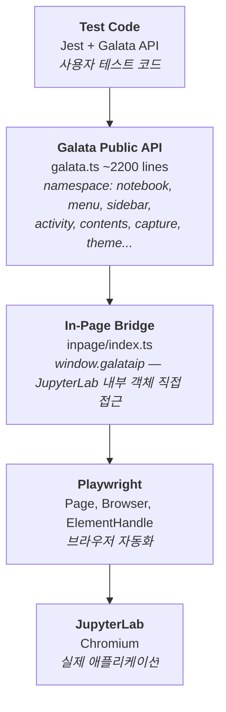
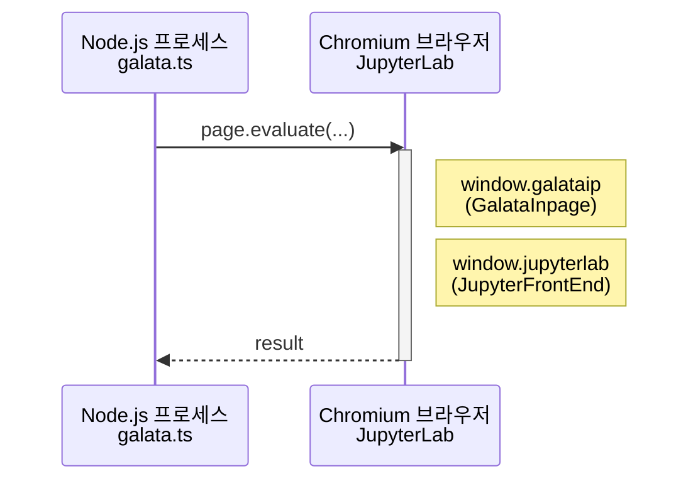
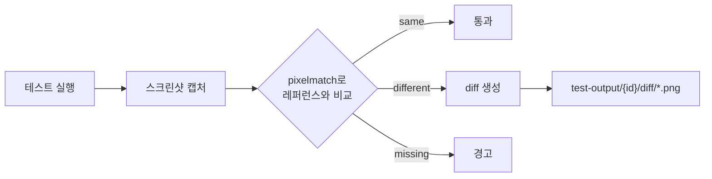
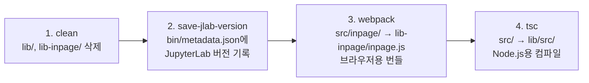

# Galata 기술 분석 문서

## 1. 프로젝트 개요

| 항목 | 내용 |
|------|------|
| 이름 | @jupyterlab/galata |
| 버전 | 3.0.11-4 |
| 라이선스 | BSD-3-Clause |
| 원 저작권 | Bloomberg Finance LP |
| 현 관리 | Project Jupyter |
| 상태 | Archived (jupyterlab/jupyterlab 메인 레포로 통합) |

Galata는 JupyterLab 전용 E2E/UI 테스트 프레임워크로, Playwright 기반의 브라우저 자동화 위에 JupyterLab 도메인 특화 API를 제공한다.

---

## 2. 아키텍처

### 2.1 레이어 구조



### 2.2 핵심 설계 결정

- **Namespace 기반 API**: `galata.notebook.*`, `galata.menu.*` 등 도메인별 그룹핑
- **In-Page Injection**: `window.galataip`를 통해 JupyterLab의 `JupyterFrontEnd` 객체에 직접 접근
- **Jest Custom Environment**: Playwright 라이프사이클을 Jest에 통합
- **Workspace 격리**: 테스트당 자동 생성되는 워크스페이스로 상태 격리

---

## 3. 모노레포 구조

```
galata.lks21c/
├── packages/
│   ├── galata/                    # 핵심 프레임워크
│   │   ├── src/
│   │   │   ├── galata.ts          # 메인 공개 API
│   │   │   ├── tokens.ts          # 타입 정의 & 인터페이스
│   │   │   ├── global.ts          # 전역 타입 선언
│   │   │   └── inpage/            # 브라우저 내 실행 코드
│   │   ├── bin/
│   │   │   └── cli.js             # CLI (galata/glt 명령)
│   │   ├── tests/                 # 자체 테스트
│   │   ├── jest-env.js            # Jest 커스텀 환경
│   │   ├── jest-setup.js          # 글로벌 셋업
│   │   ├── jest-teardown.js       # 글로벌 티어다운
│   │   └── webpack.config.js      # inpage 번들 빌드
│   └── galata-example/            # 사용 예제 프로젝트
├── lerna.json                     # Lerna 모노레포 설정
└── package.json                   # Yarn workspaces 루트
```

도구: **Lerna** + **Yarn Workspaces** 기반 모노레포

---

## 4. 핵심 기술 스택

### 4.1 의존성 맵

| 영역 | 라이브러리 | 버전 | 역할 |
|------|-----------|------|------|
| 브라우저 자동화 | playwright | ^1.9.1 | 멀티 브라우저 제어 |
| 테스트 러너 | jest | ^25.1.0 | 테스트 실행/검증 |
| TS 통합 | ts-jest | ^25.2.0 | TypeScript 테스트 |
| 이미지 비교 | pixelmatch | ^5.1.0 | 스크린샷 diff |
| PNG 처리 | pngjs | ^3.4.0 | 이미지 읽기/쓰기 |
| HTTP | axios | ^0.21.1 | JupyterLab API 호출 |
| CLI | meow + inquirer | ^6.0/^7.1 | CLI 파싱/인터랙션 |
| 빌드 | webpack | ^5.7.0 | inpage 번들링 |

### 4.2 JupyterLab 연동

```
@jupyterlab/application    (3.0.11) - JupyterFrontEnd 접근
@jupyterlab/notebook        (3.0.11) - NotebookPanel 조작
@jupyterlab/docmanager      (3.0.11) - 문서 관리
@jupyterlab/nbformat        (3.0.11) - 노트북 포맷
```

---

## 5. 공개 API 상세

### 5.1 Notebook API

Galata의 가장 풍부한 API 영역으로, 노트북의 전체 라이프사이클을 제어한다.

```typescript
// 라이프사이클
galata.notebook.open(name)
galata.notebook.createNew(name?)
galata.notebook.save()
galata.notebook.close(revertChanges?)

// 실행
galata.notebook.run()
galata.notebook.runCell(cellIndex, inplace?)
galata.notebook.runCellByCell(callback?)
galata.notebook.waitForRun()

// 셀 조작
galata.notebook.addCell(cellType, source)
galata.notebook.setCell(cellIndex, cellType, source)
galata.notebook.getCellCount()
galata.notebook.getCellTextOutput(cellIndex)
galata.notebook.deleteCells()

// 편집 모드
galata.notebook.enterCellEditingMode(cellIndex)
galata.notebook.leaveCellEditingMode(cellIndex)

// 셀 접기/펼치기
galata.notebook.expandCellInput(cellIndex, expand)
galata.notebook.expandCellOutput(cellIndex, expand)
```

### 5.2 Capture & Visual Regression API

```typescript
// 스크린샷 캡처
galata.capture.screenshot(fileName, element?)

// 레퍼런스 비교 (Visual Regression)
galata.capture.compareScreenshot(fileName) -> CaptureCompareResult

// HTML 캡처 및 비교
galata.capture.captureHTML(fileName, element?)
galata.capture.compareHTML(fileName) -> CaptureCompareResult
```

비교 결과 타입:
```typescript
type CaptureCompareResult =
  | 'uncompared'
  | 'missing-capture'
  | 'missing-reference'
  | 'different-size'
  | 'different'
  | 'same'
```

### 5.3 UI 제어 API

| 네임스페이스 | 주요 메서드 | 용도 |
|-------------|-----------|------|
| `galata.menu` | `open`, `clickMenuItem`, `closeAll` | 메뉴 탐색/실행 |
| `galata.activity` | `activateTab`, `closeAll`, `getPanel` | 탭/패널 관리 |
| `galata.sidebar` | `open`, `close`, `openTab`, `setTabPosition` | 사이드바 제어 |
| `galata.filebrowser` | `openDirectory`, `getCurrentDirectory`, `refresh` | 파일 탐색 |
| `galata.contents` | `fileExists`, `createDirectory`, `moveFileToServer` | 파일 시스템 |
| `galata.kernel` | `isAnyRunning`, `shutdownAll` | 커널 관리 |
| `galata.theme` | `setDarkTheme`, `setLightTheme`, `setTheme` | 테마 전환 |
| `galata.statusbar` | `isVisible`, `show`, `hide` | 상태바 제어 |
| `galata.logconsole` | `logCount` | 로그 콘솔 |

### 5.4 유틸리티 API

```typescript
galata.waitFor(condition | duration, timeout?)  // 조건/시간 대기
galata.waitForTransition(element)                // CSS 전환 완료 대기
galata.resetUI()                                 // UI 기본 상태 초기화
galata.createNewPage(options?)                   // 새 브라우저 페이지
galata.reloadPage()                              // 페이지 새로고침
galata.isInSimpleMode()                          // 심플 모드 확인
galata.toggleSimpleMode(simple)                  // 심플 모드 전환
```

---

## 6. In-Page Bridge 메커니즘

Galata의 핵심 기술적 차별점은 **In-Page Injection** 패턴이다.

### 6.1 동작 원리



### 6.2 GalataInpage 클래스

브라우저 컨텍스트에서 실행되며, JupyterLab의 내부 플러그인 시스템에 직접 접근한다.

```typescript
class GalataInpage {
  app: JupyterFrontEnd;

  async getPlugin<K>(pluginId: K): Promise<Plugin>;
  async waitForLaunch(path?): Promise<void>;
  async saveActiveNotebook(): Promise<void>;
  async runActiveNotebookCellByCell(callbacks?): Promise<void>;
  async setTheme(themeName): Promise<void>;
  isElementVisible(element): boolean;
}
```

### 6.3 전역 타입 확장

```typescript
declare global {
  interface Window {
    jupyterlab: JupyterFrontEnd;     // JupyterLab 앱 인스턴스
    galataip: IGalataInpage;          // In-Page API
    screenshot: (fileName: string) => Promise<void>;
  }
  namespace NodeJS {
    interface Global {
      __TEST_CONTEXT__: IGalataContext;  // 테스트 컨텍스트
    }
  }
}
```

---

## 7. 테스트 인프라

### 7.1 Jest 커스텀 환경 (jest-env.js)

Jest의 기본 환경을 확장하여 Playwright 브라우저 인스턴스를 관리한다.

주요 역할:
- Playwright 브라우저 인스턴스 생성/관리
- `galataip` 객체를 브라우저 컨텍스트에 주입
- `__TEST_CONTEXT__` 전역 변수 설정
- 페이지 생성, 로딩, 티어다운 처리
- Galata/JupyterLab 버전 일치 검증
- 테마 적용

### 7.2 글로벌 셋업/티어다운

```
jest-setup.js  → Playwright 브라우저 런치, JupyterLab 버전 확인, 세션 정보 저장
jest-teardown.js → 브라우저 종료, 로그 파일 저장
```

### 7.3 테스트 시퀀서 (jest-sequencer.js)

테스트 실행 순서를 제어하여 테스트 간 격리를 보장한다.

### 7.4 Visual Regression 파이프라인



설정 가능한 매칭 임계값: `imageMatchThreshold` (기본 0.1)

---

## 8. CLI (galata/glt)

### 8.1 주요 옵션

| 옵션 | 기본값 | 설명 |
|------|--------|------|
| `--browser-type` | chromium | 브라우저 종류 (chromium/firefox/webkit) |
| `--headless` | true | 헤드리스 모드 |
| `--page-width` / `--page-height` | 1024 / 768 | 뷰포트 크기 |
| `--jlab-base-url` | http://localhost:8888 | JupyterLab URL |
| `--image-match-threshold` | 0.1 | 이미지 비교 허용 오차 |
| `--skip-visual-regression` | false | Visual Regression 스킵 |
| `--generate-workspace` | true | 테스트별 워크스페이스 자동 생성 |
| `--slow-mo` | 0 | 작업 지연 (디버깅용, ms) |
| `--output-dir` | ./test-output | 결과 출력 디렉터리 |
| `--reference-dir` | ./reference-output | 레퍼런스 이미지 디렉터리 |

### 8.2 특수 명령

```bash
galata --launch-result-server [test-id]  # 기존 결과 HTTP 서버로 조회
galata --update-references [test-id]     # 레퍼런스 파일 업데이트
galata --delete-references               # 레퍼런스 전체 삭제
```

---

## 9. 빌드 시스템

### 9.1 빌드 파이프라인



### 9.2 TypeScript 설정

| 설정 | 값 |
|------|-----|
| Target | ES2018 |
| Module | CommonJS |
| Declaration | true (.d.ts 생성) |
| Strict | 부분 적용 (noUnusedLocals, noImplicitReturns, noImplicitThis) |
| Lib | ES2015, DOM |

### 9.3 Webpack (inpage 번들)

- Entry: `src/inpage/index.ts`
- Output: `lib-inpage/inpage.js`
- Target: `web` (브라우저 실행)
- 로더: ts-loader, style-loader, raw-loader 등

---

## 10. 테스트 출력물 구조

```
test-output/{test-id}/
├── screenshots/              # 캡처된 스크린샷
│   └── diff/                 # 불일치 diff 이미지
├── html/                     # 캡처된 HTML
│   └── diff/                 # HTML diff 마커
├── galata-output.json        # 캡처 및 로그 메타데이터
├── session.json              # 세션 정보 (버전, 설정)
├── jest-logs.json            # Jest/Galata 로그
└── report/                   # HTML 리포트

reference-output/
├── screenshots/              # 레퍼런스 스크린샷
└── html/                     # 레퍼런스 HTML
```

---

## 11. CI/CD

**GitHub Actions** (`.github/workflows/main.yml`):

```yaml
트리거: main 브랜치 push, 모든 PR
환경: Ubuntu Latest, Node 14.x, Python 3.7

파이프라인:
  1. 코드 체크아웃
  2. Node.js + Python 환경 설정
  3. JupyterLab ~3.0.11 설치
  4. yarn install (의존성)
  5. eslint 체크
  6. yarn build (전체 빌드)
  7. JupyterLab 백그라운드 실행
  8. JupyterLab API 준비 대기
  9. yarn test:ci (테스트 실행)
```

---

## 12. 버전 관리 전략

Galata 버전은 JupyterLab 버전과 동기화한다:

```
Galata 3.0.11-4  →  JupyterLab 3.0.11
         │
         └─ "-4" = Galata 자체 패치 릴리스 (네 번째)
```

빌드 시 `bin/metadata.json`에 JupyterLab 버전을 기록하고, Jest 환경에서 런타임 버전 일치를 검증한다.

---

## 13. 코드 품질 도구

| 도구 | 설정 |
|------|------|
| ESLint | TypeScript + Prettier 통합, strict equality, single quotes |
| Prettier | singleQuote, trailingComma: none, arrowParens: avoid |
| TypeScript | 부분적 strict 모드 |

---

## 14. 기술적 특징 요약

1. **도메인 특화 추상화**: Playwright의 저수준 API를 JupyterLab 도메인 언어로 래핑
2. **In-Page Bridge**: 브라우저 내 JupyterLab 플러그인 시스템에 직접 접근하는 이중 컨텍스트 실행
3. **Visual Regression**: pixelmatch 기반 스크린샷/HTML 비교로 UI 변경 감지
4. **테스트 격리**: 워크스페이스 자동 생성으로 테스트 간 상태 오염 방지
5. **멀티 브라우저**: Playwright 기반 chromium/firefox/webkit 지원
6. **CLI 우선 설계**: 프로그래밍 방식과 CLI 방식 모두 지원
7. **JupyterLab 버전 동기화**: 프레임워크-애플리케이션 버전 일치 보장
