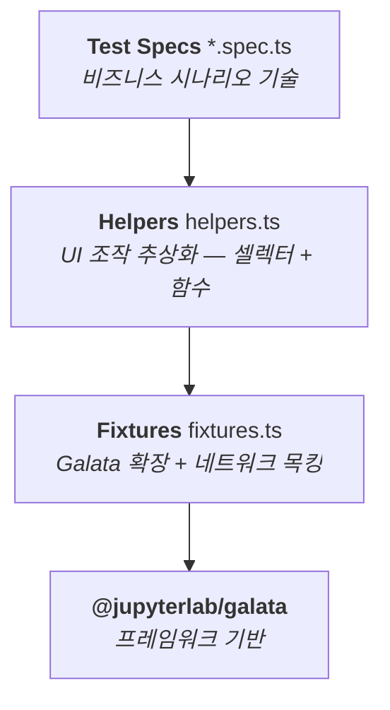
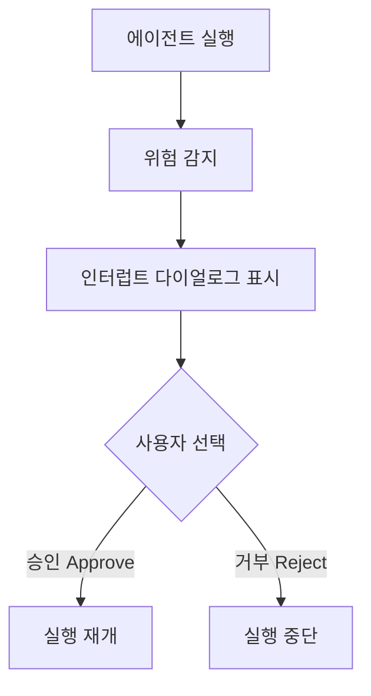
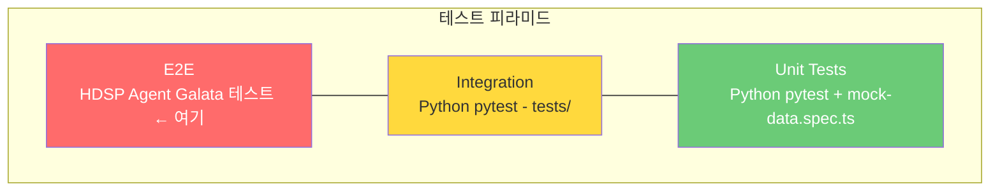
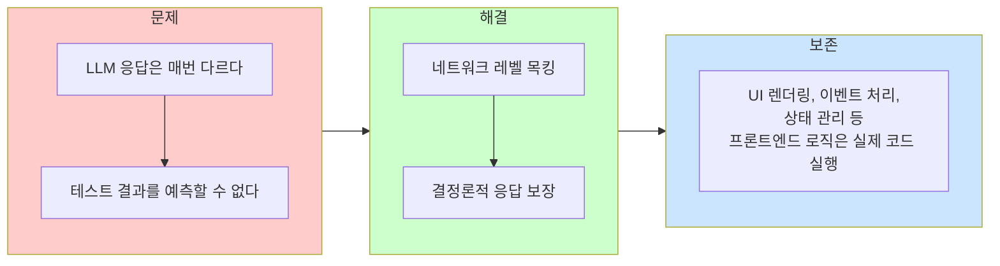

# HDSP Agent의 Galata 기반 E2E 테스트 - 기술적 의미 분석

## 1. 개요

HDSP Agent는 JupyterLab 확장 프로그램으로서 AI 기반 코딩 어시스턴트 기능을 제공한다. 이 프로젝트는 Galata를 기반으로 한 포괄적인 E2E 테스트 스위트를 구축하여, JupyterLab 생태계에서의 UI 테스트 자동화를 실현하고 있다.

---

## 2. 테스트 아키텍처

### 2.1 구조

```
e2e/ui/
├── fixtures.ts              # Galata 확장 + 네트워크 목킹
├── helpers.ts               # UI 헬퍼 함수 (50+ 함수, 80+ 셀렉터)
├── chat-mode.spec.ts        # 채팅 모드 테스트
├── agent-mode.spec.ts       # 에이전트 모드 테스트
├── hitl-approval.spec.ts    # Human-in-the-Loop 승인 테스트
├── settings-panel.spec.ts   # 설정 다이얼로그 테스트
├── error-recovery.spec.ts   # 오류 복구 테스트
├── agent-cancel.spec.ts     # 실행 취소 테스트
├── mock-data.spec.ts        # 목 데이터 구조 검증
├── code-block-toggle.spec.ts # 코드 블록 렌더링 테스트
└── websocket-agent.spec.ts  # WebSocket 전송 (향후 구현)
```

### 2.2 3계층 분리 패턴



이 분리는 다음을 보장한다:
- **테스트 코드**: 비즈니스 로직에만 집중
- **헬퍼 레이어**: UI 변경 시 한 곳만 수정
- **픽스처 레이어**: 인프라 설정의 중앙 관리

---

## 3. 기술적 의미

### 3.1 네트워크 목킹을 통한 Zero-Token 테스트

가장 중요한 기술적 결정 중 하나는 **Plan B 아키텍처**로, 모든 LLM API 호출을 네트워크 레벨에서 차단하고 목 응답으로 대체한다.

```typescript
// fixtures.ts - 자동 활성화되는 네트워크 목킹
export const test = base.extend<{ mockNetwork: void }>({
  mockNetwork: [
    async ({ page }, use) => {
      await setupNetworkMocking(page);
      await use();
    },
    { auto: true }  // 모든 테스트에 자동 적용
  ]
});
```

차단되는 외부 API:
- `**/api.openai.com/**`
- `**/api.anthropic.com/**`
- `**/generativelanguage.googleapis.com/**`

목킹되는 내부 엔드포인트:
- `**/hdsp-agent/cli/stream` (SSE 스트리밍 응답)
- `**/hdsp-agent/cli/execute` (비스트리밍 응답)
- `**/hdsp-agent/shell/execute` (셸 명령 실행)
- `**/hdsp-agent/agent/langchain/resume` (HITL 재개)

**기술적 의미**:
- E2E 테스트 실행에 API 키나 토큰 소비가 불필요
- 테스트 결과의 결정론적 재현성 보장
- CI/CD에서 외부 서비스 의존성 제거
- 비용 제로의 반복 테스트 가능

### 3.2 SSE 스트리밍 프로토콜 테스트

HDSP Agent는 Server-Sent Events(SSE)를 통해 AI 응답을 스트리밍한다. 목 시스템은 실제 SSE 프로토콜을 충실히 재현한다.

```typescript
// SSE 응답 형식 충실 재현
route.fulfill({
  status: 200,
  contentType: 'text/event-stream',
  body: createSSEBody(mockResponse)
});
```

이는 단순한 JSON 응답 목킹과는 차원이 다르다:
- **프로토콜 수준 검증**: SSE 파싱, 이벤트 처리, 스트림 종료 등 실제 전송 계층 동작을 테스트
- **점진적 렌더링 테스트**: 스트리밍 중 UI 업데이트 동작 검증
- **에러 시나리오 재현**: 비정상 SSE 스트림, 커넥션 중단 등을 목으로 재현

### 3.3 JupyterLab 확장과 노트북의 통합 테스트

Galata를 사용함으로써 JupyterLab의 핵심 기능(노트북, 셀, 커널)과 HDSP Agent 확장이 함께 동작하는 것을 검증한다.

테스트되는 통합 시나리오:

| 시나리오 | 관련 JupyterLab 기능 | HDSP Agent 기능 |
|---------|---------------------|----------------|
| 셀 코드 설명 요청 | 셀 선택, 셀 내용 읽기 | E 버튼 → AI 설명 |
| 셀 오류 수정 | 셀 실행, 오류 출력 | F 버튼 → AI 수정 제안 |
| 에이전트 분석 | 노트북 생성, 셀 추가 | 자율 분석 → 계획 수립 → 실행 |
| 설정 영속화 | JupyterLab localStorage | 설정 다이얼로그 → 저장 |

**기술적 의미**:
- 순수 단위 테스트로는 검증 불가능한 **확장-플랫폼 간 상호작용**을 테스트
- 실제 JupyterLab 인스턴스에서 실행되므로 DOM 구조, CSS 렌더링, 이벤트 전파 등이 실제와 동일
- 노트북 조작 → AI 응답 → UI 업데이트의 전체 사이클을 하나의 테스트로 검증

### 3.4 Human-in-the-Loop(HITL) 워크플로우 자동 검증

AI 에이전트가 위험한 작업(파일 삭제, 시스템 명령 등)을 수행할 때 사용자 승인을 요구하는 HITL 패턴을 E2E 테스트로 검증한다.



테스트 항목:
- 인터럽트 다이얼로그 표시 및 정보(도구명, 인자, 위험 수준) 표시
- 승인/거부 버튼 동작
- 승인 후 실행 재개
- Auto-Approve 활성화 시 인터럽트 바이패스

**기술적 의미**:
- AI 안전성 관련 UI 흐름을 자동화 테스트로 회귀 방지
- HITL은 AI 에이전트의 핵심 안전 메커니즘이며, 이를 E2E로 검증하는 것은 프로덕션 신뢰성에 직결

### 3.5 종합적 셀렉터 카탈로그

`helpers.ts`에 80개 이상의 CSS 셀렉터가 중앙 관리된다.

```typescript
// 카테고리별 셀렉터
// Core JupyterLab
mainDockPanel, launcher, notebook, cell, cellInput, leftPanel

// HDSP Agent Panel
panel, panelHeader, input, sendButton, clearButton, settingsButton

// Messages
messages, messageUser, messageAssistant, messageContent, messageLoading

// Cell Action Buttons
buttonExplain, buttonFix, buttonCustom

// Agent Execution
status, statusPlanning, statusExecuting, statusCompleted, statusFailed

// Plan Display
plan, planSteps, step, stepCurrent, stepCompleted, stepFailed, stepPending

// HITL Interrupt
interruptOverlay, interruptDialog, interruptApproveBtn, interruptRejectBtn

// Settings
settingsSelect, settingsInput, autoApproveCheckbox, temperatureSlider
```

**기술적 의미**:
- UI 구조 변경 시 **셀렉터만 수정**하면 모든 테스트가 자동 대응
- Page Object Pattern의 변형으로, 유지보수성을 극대화
- JupyterLab 기본 요소와 HDSP Agent 커스텀 요소를 명확히 구분

---

## 4. 테스트 커버리지 분석

### 4.1 기능별 커버리지

| 기능 영역 | 테스트 파일 | 테스트 수 | 커버 범위 |
|-----------|------------|----------|----------|
| 채팅 모드 | chat-mode.spec.ts | ~10 | E/F/? 버튼, 채팅 입력, 대화 관리 |
| 에이전트 모드 | agent-mode.spec.ts | ~8 | 계획 생성, 단계 실행, 완료, 셀 생성 |
| HITL 승인 | hitl-approval.spec.ts | ~6 | 인터럽트, 승인/거부, 자동 승인 |
| 설정 패널 | settings-panel.spec.ts | ~8 | 프로바이더, API 키, 워크스페이스, 영속화 |
| 오류 복구 | error-recovery.spec.ts | ~5 | HTTP 500/429, 비정상 SSE, 재시도 |
| 실행 취소 | agent-cancel.spec.ts | ~3 | 취소 버튼, 상태 초기화 |
| 목 데이터 | mock-data.spec.ts | ~6 | 응답 구조 유효성 |

### 4.2 테스트 피라미드에서의 위치



E2E 테스트가 커버하는 고유 영역:
- **브라우저 렌더링**: CSS, 레이아웃, 애니메이션
- **사용자 인터랙션**: 클릭, 입력, 키보드 단축키
- **비동기 UI 업데이트**: SSE 수신 → DOM 업데이트
- **JupyterLab 플랫폼 연동**: 확장 로딩, 패널 시스템, 노트북 통합

---

## 5. Galata 선택의 기술적 근거

### 5.1 왜 Galata인가? (vs 일반 Playwright)

| 측면 | 일반 Playwright | Galata |
|------|----------------|--------|
| JupyterLab 로딩 | 수동 URL 탐색 + 준비 대기 | 자동 서버 시작 + 준비 감지 |
| 노트북 조작 | DOM 셀렉터 직접 작성 | `galata.notebook.*` API |
| 워크스페이스 | 수동 상태 관리 | 자동 격리 |
| 플러그인 접근 | 불가능 (외부에서만 관찰) | `window.galataip.getPlugin()` |
| 버전 호환성 | 수동 검증 | 자동 버전 매칭 |

### 5.2 왜 Galata인가? (vs Cypress, Selenium 등)

| 측면 | Cypress/Selenium | Galata |
|------|-----------------|--------|
| JupyterLab 이해 | 없음 | 네이티브 |
| 커널 관리 | 불가능 | `galata.kernel.*` |
| Visual Regression | 별도 도구 필요 | 내장 |
| 타입 안전성 | 제한적 | TypeScript 네이티브 |
| 커뮤니티 | 범용 | JupyterLab 전용, 공식 |

### 5.3 HDSP Agent가 v5를 사용하는 이유

```json
"@jupyterlab/galata": "^5.0.0"
```

- HDSP Agent는 JupyterLab 4.x 기반 확장으로 개발됨
- Galata v5는 JupyterLab 4.x에 대응하며, Playwright Test를 네이티브 테스트 러너로 사용 (Jest 대체)
- 이 레포(galata.lks21c)의 v3은 JupyterLab 3.x 시기의 독립 프레임워크이고, v5부터는 JupyterLab 메인 레포에 통합

---

## 6. 엔지니어링 패턴과 모범 사례

### 6.1 Setup-Action-Assert 패턴

모든 테스트가 일관된 구조를 따른다:

```typescript
test('E 버튼으로 셀 코드 설명', async ({ page }) => {
  // Setup
  await createNotebook(page);
  await typeInCell(page, 'import pandas as pd');
  await openAgentPanel(page);

  // Action
  await clickCellButton(page, 'explain');
  await confirmDialog(page);

  // Assert
  await waitForLoadingComplete(page);
  const response = await waitForAssistantResponse(page);
  expect(response).toBeTruthy();
  expect(response).toContain('pandas');
});
```

### 6.2 자동 활성화 픽스처

네트워크 목킹이 `{ auto: true }`로 설정되어 모든 테스트에 자동 적용된다. 개별 테스트에서 목킹을 의식할 필요가 없다.

### 6.3 헬퍼 함수를 통한 추상화

50개 이상의 헬퍼 함수가 저수준 Playwright 조작을 의미 있는 도메인 동작으로 변환한다:

```typescript
// 저수준 (Playwright)
await page.locator('.jp-Cell').nth(0).locator('.jp-InputArea-editor').click();
await page.keyboard.type('import pandas');

// 고수준 (HDSP Agent Helper)
await typeInCell(page, 'import pandas', 0);
```

### 6.4 Playwright 설정 최적화

```typescript
{
  workers: 1,                      // JupyterLab 단일 인스턴스 제약
  retries: 1,                     // 비결정적 실패 대응
  trace: 'retain-on-failure',     // 실패 시 디버깅 추적
  video: 'retain-on-failure',     // 실패 시 영상 기록
  screenshot: 'only-on-failure',  // 실패 시 스크린샷
}
```

---

## 7. AI 애플리케이션 E2E 테스트로서의 차별적 가치

### 7.1 AI 응답의 비결정성 해결

AI 애플리케이션의 근본적 테스트 난제는 응답의 비결정성이다. HDSP Agent의 접근:



이 방식은 "AI 백엔드는 신뢰하되, 프론트엔드 통합은 검증한다"는 실용적 전략이다.

### 7.2 AI 안전성 UI의 회귀 테스트

HITL 테스트는 AI 안전성과 직결된다:
- 위험한 작업 감지 시 반드시 사용자 확인을 거치는지
- 거부 시 실행이 확실히 중단되는지
- Auto-Approve 설정이 정확히 동작하는지

이런 안전 메커니즘이 코드 변경으로 깨지면 실제 사용자 피해로 이어질 수 있으며, E2E 테스트가 이를 방지한다.

### 7.3 스트리밍 UI의 통합 검증

AI 채팅 인터페이스의 핵심인 SSE 스트리밍 응답 처리를 실제 브라우저에서 검증한다:
- 스트리밍 중 로딩 인디케이터 표시
- 점진적 텍스트 렌더링
- 스트림 완료 후 UI 상태 전이
- 비정상 스트림 종료 시 에러 처리

---

## 8. 결론

HDSP Agent의 Galata 기반 E2E 테스트는 다음과 같은 기술적 의미를 갖는다:

1. **JupyterLab 생태계 전용 테스트**: 범용 E2E 도구로는 달성하기 어려운 노트북/확장/커널의 통합 테스트를 실현
2. **Zero-Token E2E**: 네트워크 목킹으로 AI API 비용 없이 완전한 E2E 테스트 수행
3. **AI 안전성 보장**: HITL 워크플로우의 자동 회귀 테스트로 AI 에이전트 안전 메커니즘 보호
4. **SSE 프로토콜 검증**: 스트리밍 응답의 프론트엔드 처리를 프로토콜 수준에서 테스트
5. **유지보수 가능한 구조**: 3계층 분리(Fixture → Helper → Spec)와 중앙 셀렉터 관리로 장기적 유지보수성 확보
6. **CI/CD 적합성**: 외부 의존성 없는 결정론적 테스트로 자동화 파이프라인에 안정적 통합
